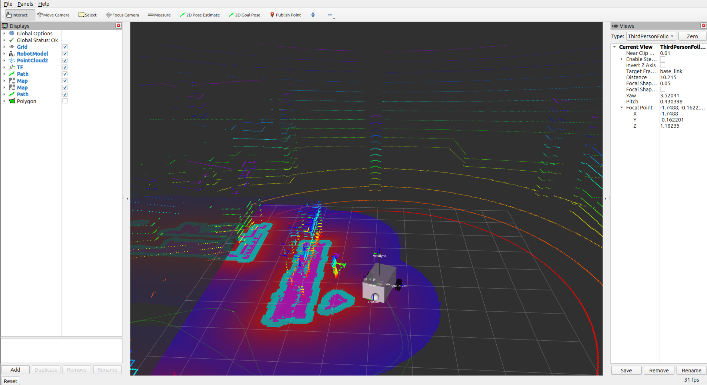
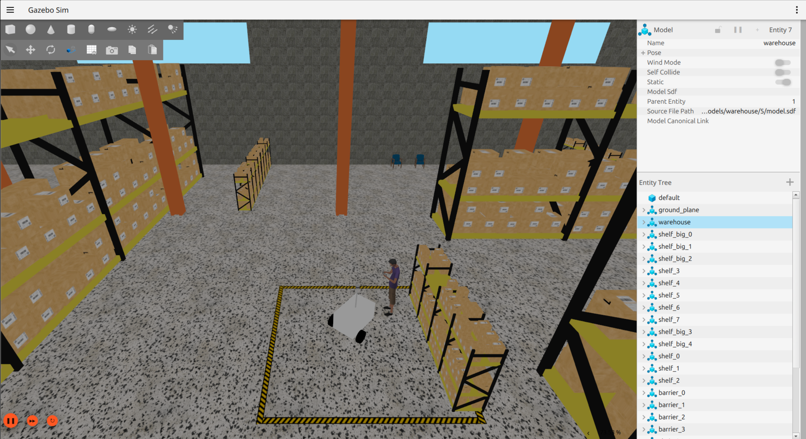

# Imprimis
This repository contains necessary software for Imprimis, a fully autonomous ground vehicle developed by the HyperRobotics VIP at VCU. The ROS packages inside imprimis_ws run on the robot's main PC to process sensor information, make autonomous decisions, and communicate with the robot's onboard microcontrollers. The firmwares in EspFirmware run on the robot's microcontrollers which handle hardware connectivity and control.

[Complete Software Diagram](https://drive.google.com/file/d/1ad0O14qcB_6zf1_6lL17tQPe5xx5yQ5I/view)

# Microcontroller Firmwares in EspFirmware
* Board A: ESP32 connected to the Main PC, status lights, radio receiver, and wirelessly to board B
* Board B: ESP32 connected to the robot's motors and wirelessly to board A

# ROS Packages in imprimis_ws/src
* imprimis_hardware_platform: Contains all configuration files for hardware and sensors, and implements the hardware interface. Has a launch file which starts up all the hardware, either real or simulated.
* imprimis_description: Describes the robot with URDF files for other packages.
* imprimis_navigation: Contains all configuration and launch files for localization and nav2.
* gps_nav_bridge: Handles input navigation waypoints and GPS goal -> map goal conversion.
* um7: Driver for the um7 IMU.
* lidarslam, lidarslam_msgs, scanmatcher, thirdparty: Packages used for SLAM with the Lidar.
* serial-ros2: Serial library for microcontroller communications.

# Install/run instructions for Offboard Computer
This software usually runs on the robot's main computer, but it is possible to run in a simulated mode on a different machine with the following steps:

  1. Ensure you are running Ubuntu 24.04 and [install ROS2 Jazzy.](https://docs.ros.org/en/jazzy/Installation/Ubuntu-Install-Debs.html)
  2. Source ROS: ```source /opt/ros/jazzy/setup.bash``` 
  3. Clone this repository: ```git clone https://github.com/Hyperloop-VCU/imprimis.git```
  4. Navigate to workspace root: ```cd imprimis/imprimis_ws```
  5. Install ROS dependencies: ```rosdep install --from-paths src --ignore-src -r -y```
  6. Build workspace: ```colcon build```
  7. Source workspace: ```source install/setup.bash```
  8. Change permissions for gazebo fixer script: ```chmod 777 ./fix_gazebo.bash```
  9. Run the gazebo fixer script: ```./fix_gazebo.bash```
  10. Launch simulated robot: ```ros2 launch imprimis_navigation basic_nav.launch.py hardware_type:=simulated```

You should see two windows appear - a simulated world with the robot in it (gazebo), and a ROS visualization tool (rviz) which shows the LiDAR data and navigation maps.




Be patient - it takes some time for everything to start up. Once you see the navigation maps on the ground, you can give the robot a goal waypoint by using the "2D Goal Pose" tool in the top bar of rviz. The robot will begin navigating to the goal, avoiding obstacles along the way.


