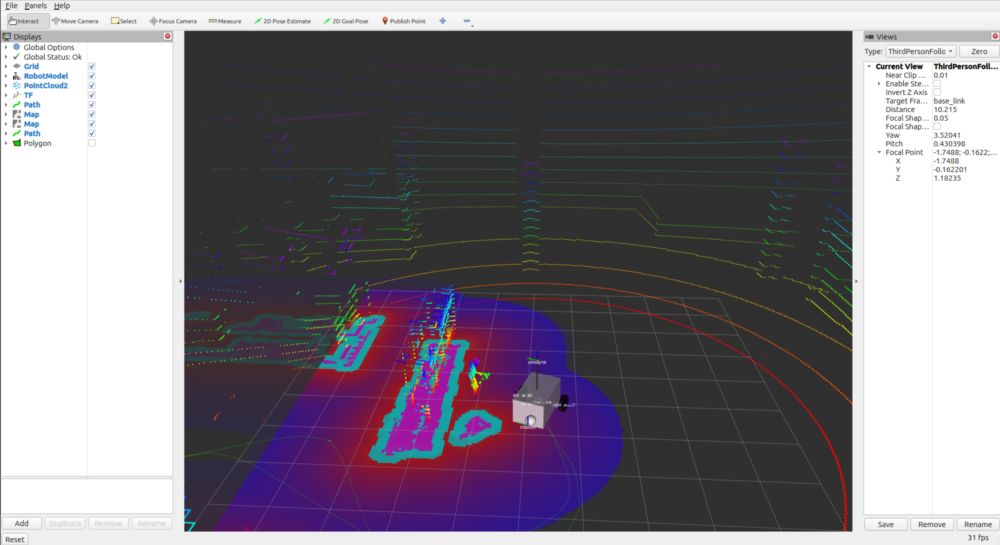
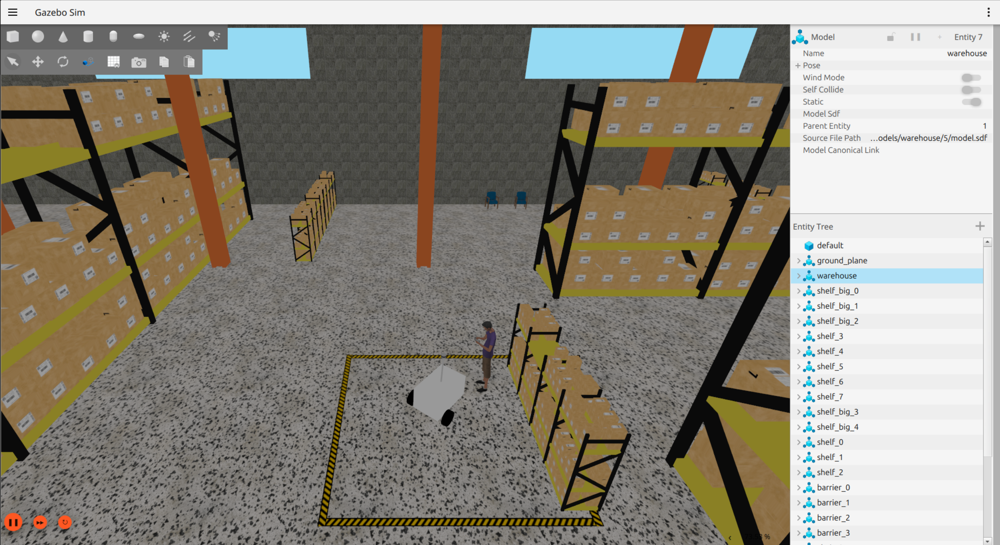

# Imprimis
This repository contains necessary software for Imprimis, a fully autonomous ground vehicle developed by the HyperRobotics VIP at VCU. The ROS packages inside imprimis_ws run on the robot's main PC to process sensor information, make autonomous decisions, and communicate with the robot's onboard microcontrollers. The firmwares in EspFirmware run on the robot's microcontrollers which handle hardware connectivity and control.

[Visual Software Diagram and Structure](https://drive.google.com/file/d/1ad0O14qcB_6zf1_6lL17tQPe5xx5yQ5I/view)

# Microcontroller Firmwares in EspFirmware
## Board A
Board A is the interface between the robot's main PC and non USB or ethernet enabled hardware. It's wirelessly connected to Board B via ESP-NOW, USB-connected to the robot's main PC, UART-connected to the FlySky I-BUS Radio Receiver, and GPIO-connected to the yellow and green status lights.

* **Motor Control**: Board A constantly sends desired motor setpoints/efforts and other commands to Board B. It also receives the current wheel velocities from Board B and forwards them to the main PC via USB.

* **Operating Modes**: A switch on the FlySky RC controller determines manual/autonomous mode. In autonomous mode, the board will ignore the joystick input and forward the main PC's angular velocity commands to Board B. In manual mode, the board will ignore the main PC's commands and forward the joystick input to Board B. The current angular velocities, operating mode, and Board B / motor status (connected or not) are always sent to the main PC regardless of operating mode. In other words, the only way the main PC can tell what mode we're in is via the sent status; the communication interface does not change between modes.

* **Status Lights**: When Board B is on and connected, the green light is on. The yellow light flashes on/off continuously when in autonomous mode, and is always on when in manual mode. The red light is directly connected to power and not controllable by Board A.

* **Safety logic**: If the robot is in autonomous mode and no commands are being sent to Board A over the USB connection, it will stop sending commands to Board B, which will cause the robot to stop after a short delay.

## Board B
Board B manages the motors exclusively. It is powered by the motor driver's 5V output, so it is only on when the motors are on. It's wirelessly connected to Board A via ESP-NOW, UART-connected to the Cytron MDDS60 Motor driver, and GPIO-connected to both wheel encoders through a 3.3V <-> 5V level shifter.

* **Control modes**: In autonomous mode, it wirelessly receives desired angular velocity setpoint commands for each wheel, and runs a closed-loop PID controller for each motor. In manual mode, it wirelessly receives joint efforts (0-100% power) for each motor, and simply sets the speeds directly without any PID control.

* **Encoders**: This board uses the ESP32's dedicated pulse counter hardware to read the encoder pulses from each wheel. These pulses are converted to the wheel angular velocities and send to Board A. In closed-loop mode, the wheel angvels are also used to provide feedback to the PID controllers. A bidirectional 3.3V <-> 5V logic level shifter is used between the ESP32 (3.3V only) and encoders (5V only).

* **Safety logic**: Board B expects constant commands from Board A. If it doesn't receive any for a short (configurable) time, it immediately stops the robot.

## Folder Structure
Both the **boardA** and **boardB** folders are **PlatformIO projects.** The PlatformIO VSCode extension is a nice way to work on MCU firmware without the Arduino IDE. You can clone the repo, download VSCode, get the PlatformIO extension, and open either board A or board B as a PlatformIO project in VSCode to edit the code. The **common** folder contains packet definitions and configurations shared between the two boards.

# ROS Packages in imprimis_ws/src
This folder contains some of the ROS packages required for Imprimis. Some are custom-made, and some are third-party. In addition to these packages, Imprimis depends on lots of other third-party packages (robot_localization, nav2, etc). The dependencies of each package are listed in the **package.xml** folder, and can be automatically installed by running the ```rosdep``` command in the offboard computer setup instructions. Each package has a more detailed README in its respective folder.


* **imprimis_hardware_platform**: Contains all configuration files for hardware and sensors, and implements the hardware interface. Has a launch file which starts up all the hardware, either real or simulated.
* **imprimis_description**: Describes the robot with URDF files. Has launch files to view the URDFs in rviz.
* **imprimis_navigation**: Contains all configuration and launch files for localization and nav2.
* **gps_nav_bridge**: Handles input navigation waypoints and GPS goal -> map goal conversion.
* **um7**: Third-party driver for the um7 IMU.
* **serial-ros2**: Third-party serial library for microcontroller communications.
* **map_goal_to_odom**: Used to convert navigation goals into the correct frame.

* **SLAM_Packages**: A collection of third-party packages used for global localization with the Lidar. This folder contains many packages; there is no package named "SLAM_Packages".

# Install instructions for Offboard Computer
This software usually runs on the robot's main computer, but it is possible to run in a simulated mode on a different machine.

Following the below steps will get you ready to run the Imprimis simulation on your PC:

  1. Ensure you are running Ubuntu 24.04 and [install ROS2 Jazzy.](https://docs.ros.org/en/jazzy/Installation/Ubuntu-Install-Debs.html)
  2. Source ROS: ```source /opt/ros/jazzy/setup.bash``` 
  3. Clone this repository: ```git clone https://github.com/Hyperloop-VCU/imprimis.git```
  4. Navigate to workspace root: ```cd imprimis/imprimis_ws```
  5. Install ROS dependencies: ```rosdep install --from-paths src --ignore-src -r -y```
  6. Build workspace: ```colcon build```
  7. Source workspace: ```source install/setup.bash```
  8. Change permissions for gazebo fixer script: ```chmod 777 ./fix_gazebo.bash```
  9. Run the gazebo fixer script: ```./fix_gazebo.bash```

# Using the Simulated Robot
## Hardware
To launch the simulated robot's hardware, run the following command: 
* ```ros2 launch imprimis_hardware_platform imprimis_hardware.launch.py hardware_type:=simulated```  

This will make two windows appear: the gazebo simulation and RVIZ. Gazebo is the actual physics simulator and manages world the robot exists in, and RVIZ is a GUI tool used to display all the ROS data in the system. 

Once it's running, you can publish a TwistStamped message to the ROS topic "diffbot_base_controller/cmd_vel" to drive it via rqt, the command line, or another ROS node. You can also add "use_controller:=true" to the launch command to allow any joystick controller plugged into your PC to drive the robot.

## Localization system
To launch the simulated robot hardware and localization system, run the following command:
* ```ros2 launch imprimis_navigation localization.launch.py hardware_type:=simulated```

The localization system is responsible for accurately determining where the robot is located relative to its surroundings. It has two main parts, **global** and **local** localization.
* **Global localization** is responsible for providing a **globally consistent** position estimate of the robot. No matter how long the robot drives for, this position estimate will not drift over time and stay correct. However, it does tend to be jittery and jumpy, constantly dancing around the true position of the robot, which is why we have local localization as well. Global localization provides the map->odom and map->base_link transforms. It can be done either with a LiDAR (default, best in indoor environments) or by a GPS (add "map_type:=gps" to the launch command, only works outdoors)
* **Local localization**, or "odometry", is responsible for providing a **locally accurate** position estimate of the robot. This position estimate is smooth and will not jump or jitter. However, it does drift over time as integration errors accumulate, which is why we have global localization as well. Local localization provides the odom->base_link transform. It is usually done by by fusing wheel odometry with an accurate IMU, but this IMU-fusion can be discarded by adding "disable_local_ekf:=true" to the launch command. This will provide a very inaccurate position estimate, but is useful for testing.

**The localization launch has all the launch arguments of hardware launch**, in addition to the localization specific ones like map_type and disable_local_ekf.
Many launch arguments can be passed in at a time, and the order of launch arguments does not matter. For example, if I wanted to drive the robot with a controller, use GPS-based global localization, and disable IMU fusion in local localization:
* ```ros2 launch imprimis_navigation localization.launch.py hardware_type:=simulated map_type:=gps use_controller:=true disable_local_ekf:=true```

## Navigation system
To launch the robot hardware, localization system, and navigation system, run the following command:
* ```ros2 launch imprimis_navigation basic_nav.launch.py hardware_type:=simulated nav2_params:=SmacHybrid_DWB_2```

**The navigation system is responsible for the following:**
* **Managing goals**: Given navigation goals published on the "goal_pose" topic, convert them into the appropriate coordinate frame and feed them to the rest of the system
* **Creating the costmap**: Given sensor data, create a 2-D representation of where it is safe to drive and where it isn't.
* **Computing the path**: Given the costmap and robot position estimates, compute the path the robot must take from its current position/rotation (pose) to its goal pose. This is done by the nav2 planner server.
* **Following the path**: Given the costmap, robot position estimates, and path, compute the command velocities needed to follow the path without hitting obstacles in the costmap. This is done by the nav2 controller server.

**The launch argument "nav2_params" specifies the name of the nav2 params file to use (excluding the .yaml)**. The nav2 params file is a critical piece of the robot's software, as it determines the navigation behavior of the robot. All nav2 params files must be located in imprimis_ws/src/imprimis_navigation/config/nav2. Feel free to create your own and mess around with it!

**The navigation launch has all the launch arguments of localization launch**, in addition to the navigation specific ones like nav2_params. You can still specify hardware and localization stuff like use_controller:=true and map_type:=gps when using the navigation launch. 

Launching the navigation takes some time, since it needs to start the hardware and localization systems first. Once you see the costmap (purple blobs where the obstacles are) appear in rviz, you can use rviz to give the navigation system a goal by using the "2D goal pose" tool in the top bar. 





